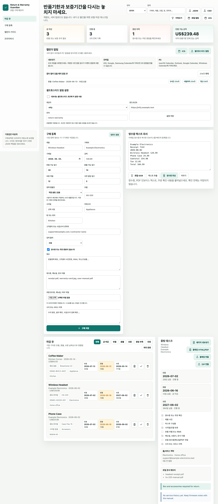

# Return & Warranty Guardian

Return & Warranty Guardian helps people avoid losing money because a return window, refund period, warranty date, or receipt location slipped past them. It is a local-first purchase memory that runs in your browser, keeps purchase records on your device, and makes deadlines, proof, and claim evidence exportable. No account, no server upload, no cloud vault required.

> Never miss a return window or warranty again.
> 기본 언어는 한국어이며, 영어, 일본어, 중국어, 독일어, 프랑스어, 이탈리아어, 힌디어 UI로 전환할 수 있습니다.

## Why It Exists



Buying things creates a scattered trail: receipts in email, model numbers on boxes, warranty cards in drawers, service notes in messages, and return policies that expire quietly. This app turns that trail into a private local deadline desk.

Core values:

- **Local-first:** records stay in browser storage unless you export them.
- **Privacy-friendly:** no backend, no account, no upload path.
- **Exportable:** JSON backup, CSV review, `.ics` calendar reminders, and Markdown evidence packs.

## Live Demo

Try the static demo on GitHub Pages:

https://cloud7-dev.github.io/return-warranty-guardian/

## What It Does

- Tracks return, refund, and warranty deadlines from one local dashboard.
- Stores purchases in browser storage with JSON export/import.
- Stores local receipt, PDF, manual, and warranty-card attachments in the browser record.
- Previews CSV purchase rows before import, supports built-in and saved user presets, manual column mapping, duplicate skipping, and invalid row reporting locally.
- Exports a local CSV import report for audit/debugging before the import is confirmed.
- Extracts local text, CSV, HTML/email receipts, simple PDF text, and supported browser-local image OCR into the receipt parser without upload.
- Parses pasted receipt or invoice text into candidate line items.
- Splits one receipt into multiple tracked purchase records.
- Exports claim-ready evidence packs as Markdown.
- Exports printable HTML claim packets with local attachment links/previews and submission templates that can be saved as PDF from the browser print dialog.
- Exports claim bundle JSON with the purchase record, deadline math, evidence pack Markdown, claim HTML, submission templates, and local attachment data URLs.
- Exports a ZIP claim bundle with HTML, Markdown, JSON, submission template files, and attached local files.
- Exports `.ics` calendar reminders for purchase deadlines.
- Exports CSV records for spreadsheet review.
- Tracks category, room/location, support contact, document names, and service notes for warranty claims and home-history context.
- Switches the interface between Korean, English, Japanese, Chinese, German, French, Italian, and Hindi.
- Works as a static web app with a PWA manifest and service worker.

## Product Boundary

Return & Warranty Guardian focuses on receipts, returns, refunds, warranties, and claim evidence. Emergency or family binder workflows are intentionally separate so the first screen stays deadline-first. See [docs/product-boundaries.md](docs/product-boundaries.md).

## Quick Start

```bash
npm run dev
```

Then open:

```text
http://127.0.0.1:4180
```

No install step is required. The app has no runtime dependencies.

## Verification

```bash
npm test
npm run build
npm run qa:browser
```

`npm test` covers the deadline engine, receipt text parser, CSV import analysis, mapping presets, import reports, evidence pack export, claim packet HTML/JSON/ZIP bundle export, claim submission templates, CSV export, and calendar export. `npm run build` verifies static file references, PWA manifest basics, service worker cache entries, responsive CSS, and required UI copy. `npm run qa:browser` runs browser interaction checks for language switching, local attachments, local HTML receipt extraction, CSV preview/manual mapping/deduplication/report export, claim packet template/JSON/ZIP bundle download, exports, search, and mobile screenshots.

## Privacy Model

Return & Warranty Guardian does not include a backend. Purchases are stored in browser storage on the current device. Clearing site data can delete purchases, so use JSON export for backups.

Local OCR/text extraction is intentionally no-upload. The current implementation handles text, CSV, HTML/email receipts, basic PDF text extraction, and image OCR when the browser exposes a local `TextDetector` API. If image OCR is not available in the current browser, the app keeps the flow local and asks the user to paste receipt text instead of calling a cloud OCR service.

This project is a tracking and evidence-organization tool. It does not guarantee that a merchant will accept a return, refund, or warranty claim.

## Notifications

The current no-server notification path is `.ics` calendar export. Mobile users can import deadlines into iOS, Google, or Samsung Calendar; desktop users can import them into macOS Calendar, Outlook, Google Calendar, or Windows Calendar. See [docs/notification-strategy.ko.md](docs/notification-strategy.ko.md) for the Korean notification plan.

## Consolidation

This repository is the consolidation target for the overlapping `return-guardian` and `home-memory-ledger` experiments. See [docs/consolidation-review.ko.md](docs/consolidation-review.ko.md) for the GitHub comparison and V2 merge direction.

## MVP Workflow

1. Add a purchase manually or paste receipt text.
2. Confirm product, merchant, purchase date, return window, refund window, and warranty duration.
3. Watch the deadline queue for due-soon or expired items.
4. Export an evidence pack before contacting the merchant.
5. Export `.ics` reminders, CSV review files, or a JSON backup when needed.

## Repository Topics

Recommended GitHub topics:

`local-first`, `privacy`, `privacy-tools`, `receipt-tracker`, `warranty-tracker`, `return-tracker`, `purchase-tracker`, `home-inventory`, `home-maintenance`, `personal-finance`, `pwa`, `offline-first`, `indexeddb`, `self-hosted`, `document-management`, `consumer-tools`, `i18n`, `multilingual`, `open-source`.

## Roadmap

See [docs/feature-backlog.md](docs/feature-backlog.md).

V2 open pain has been reflected into the product direction, but not all V2 features are implemented yet. See [docs/v2-implementation-checklist.ko.md](docs/v2-implementation-checklist.ko.md) for the implementation status.

## Contributing

See [CONTRIBUTING.md](CONTRIBUTING.md), [SECURITY.md](SECURITY.md), and [docs/release-checklist.md](docs/release-checklist.md).

## License

Apache-2.0
